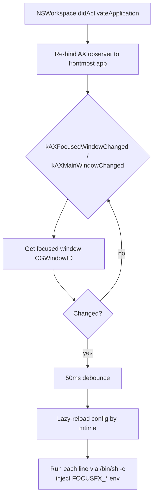

# focusfx

English | [日本語](README.md)


[](LICENSE)

A macOS resident daemon that runs an arbitrary configured command whenever the
active (focused) window changes. It is a pure passive observer and does not
depend on any external window manager. Effects
(sound, border emphasis, …) are the responsibility of the configuration
(command strings); the binary only knows **detection and dispatch — zero
hardcoding**.

## Highlights

- **No polling.** Driven by `NSWorkspace.didActivateApplication` + AX events
- Re-binds an AX observer to only the single frontmost app → lightweight
- Hot-reloads config (save → applied on next event, no restart)
- No external dependencies (plain `swiftc`)

## Architecture



## Requirements

- macOS (recent versions; uses `NSWorkspace` / AX — minimum not formally verified)
- Xcode Command Line Tools (`swiftc`)
- Accessibility permission (prompted on first run)

## Install

```sh
git clone https://github.com/akira-toriyama/focusfx.git ~/dev/focusfx
cd ~/dev/focusfx
./install.sh
```

`install.sh` self-discovers paths (username-independent):

1. Build via `build.sh`
2. Install to `~/.local/bin/focusfx`
3. Generate `~/Library/LaunchAgents/com.local.focusfx.plist`
   (with `EnvironmentVariables/PATH`)
4. Register the LaunchAgent via `launchctl` (`RunAtLoad` / `KeepAlive`)

On first run, allow `~/.local/bin/focusfx` under System Settings > Privacy &
Security > Accessibility.

## Configuration

`${XDG_CONFIG_HOME:-$HOME/.config}/focusfx/config`

- **One line = one command** (run via `/bin/sh -c`). Blank and `#` lines ignored
- Save → applied on next event (mtime hot-reload, no timer)
- Context injected as environment variables:

| Variable | Meaning |
|---|---|
| `FOCUSFX_EVENT` | `"window_focused"` |
| `FOCUSFX_WINDOW_ID` | focused window CGWindowID |
| `FOCUSFX_PID` | app PID |
| `FOCUSFX_APP` | app name |
| `FOCUSFX_TITLE` | window title |

A sample is generated when the config is missing. Each command is killed after
10 seconds as a runaway guard.

## Uninstall

```sh
launchctl bootout gui/$(id -u)/com.local.focusfx
rm ~/Library/LaunchAgents/com.local.focusfx.plist ~/.local/bin/focusfx
```

## Troubleshooting

- **Nothing happens**: Accessibility likely not granted. Check
  `~/.local/state/focusfx.log`, grant `~/.local/bin/focusfx`, restart
- **Homebrew commands fail**: launchd's default PATH lacks Homebrew; solved via
  the plist's `EnvironmentVariables/PATH` (generated by `install.sh`)
- Logs: `~/.local/state/focusfx.log` (app), `~/.local/state/focusfx.{out,err}.log`
  (launchd)

## Development

- Single-file `main.swift`. `./build.sh` produces `bin/focusfx` (git-ignored)
- Suggested commit convention: gitmoji + Conventional Commits (not enforced)
- Release notes are generated by the release workflow via `cliff.toml`

## License

[MIT](LICENSE) © 2026 akira-toriyama
