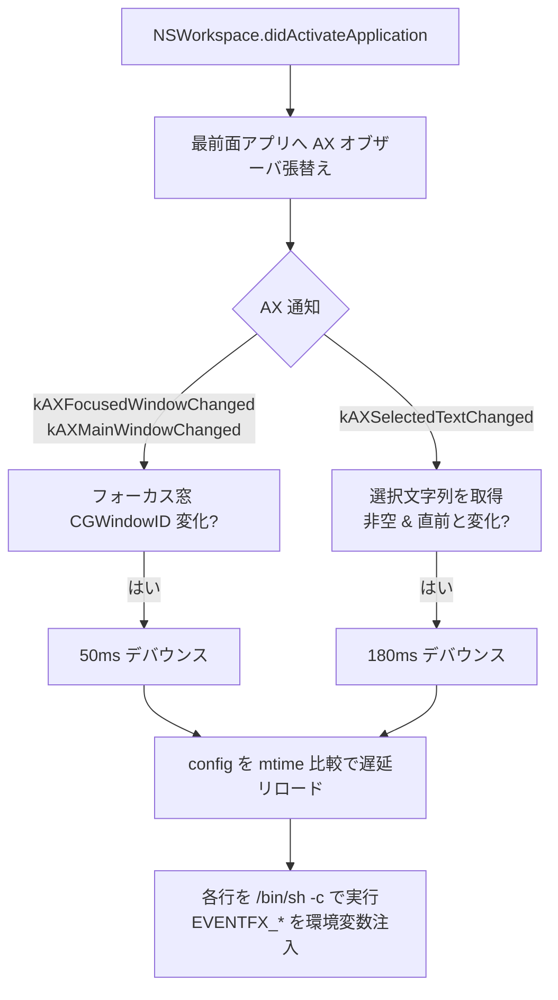

# eventfx


[](LICENSE)

[English](README.md) · **日本語**

AX 由来のイベント (**フォーカス窓変化** / **テキスト選択変化**) を検知して、設定された任意コマンドを実行する macOS 常駐デーモン。純粋な受動オブザーバで、外部のウィンドウマネージャに依存しない。効果音・枠強調・ランチャー表示などの「効果」は設定 (コマンド文字列) 側の責務で、本体は **検知とディスパッチしか持たない (ゼロハードコード)**。

## 特徴

- **ポーリングしない**。`NSWorkspace.didActivateApplication` ＋ AX イベント駆動
- 2 種類のイベント: `window_focused`, `text_selected`。`$EVENTFX_EVENT` で分岐
- 最前面アプリ 1 つにだけ AX オブザーバを張替え = 軽量
- 設定はホットリロード (保存すれば次の発火時に自動反映・再起動不要)
- 追加依存なし (純 `swiftc`)

## アーキテクチャ



## 要件

- macOS 13 以降 (Ventura+。Homebrew formula の `depends_on macos: :ventura` と一致)
- Xcode Command Line Tools (`swiftc`)。`NSWorkspace` と AX API を使用
- アクセシビリティ権限 (初回プロンプト)

## インストール

Homebrew (推奨):

```sh
brew install akira-toriyama/tap/eventfx
brew services start eventfx
```

ソースから (tap 不使用):

```sh
git clone https://github.com/akira-toriyama/eventfx.git ~/dev/eventfx
cd ~/dev/eventfx
./install.sh
```

`install.sh` は次を自己発見パスで行う (ユーザー名非依存):

1. `build.sh` でビルド
2. `~/.local/bin/eventfx` へ配置
3. `~/Library/LaunchAgents/com.local.eventfx.plist` を生成 (`EnvironmentVariables/PATH` 込み)
4. `launchctl` で LaunchAgent 登録

初回はシステム設定 > プライバシーとセキュリティ > アクセシビリティ で
`eventfx` を許可してください。

## CLI

```
eventfx                run as daemon (default)
eventfx --debug        run + stderr + /tmp/eventfx.log にもログ出力
eventfx --validate     config をパース・件数を表示して exit
eventfx --version      バージョン表示して exit
eventfx --help         ヘルプ表示して exit
```

## 設定

`${XDG_CONFIG_HOME:-$HOME/.config}/eventfx/config`

- **1 行 = 1 コマンド** (`/bin/sh -c` で実行)。空行と `#` 行は無視
- 保存すれば次の発火時に自動反映 (mtime ホットリロード・タイマー無し)
- `$EVENTFX_EVENT` で種別を判定し、各行で必要に応じてガードする
- **バックスラッシュ継続 (`\`) は効かない** — eventfx は行ごとに別コマンドとして渡すため。1 コマンドは必ず物理 1 行で書く
- 各コマンドへ context を環境変数で注入:

| 変数 | イベント | 内容 |
|---|---|---|
| `EVENTFX_EVENT` | 両方 | `"window_focused"` または `"text_selected"` |
| `EVENTFX_PID` | 両方 | アプリの PID |
| `EVENTFX_APP` | 両方 | アプリ名 |
| `EVENTFX_WINDOW_ID` | `window_focused` | フォーカス窓の CGWindowID |
| `EVENTFX_TITLE` | `window_focused` | ウィンドウタイトル |
| `EVENTFX_SELECTION` | `text_selected` | 選択された文字列 |
| `EVENTFX_CURSOR_X` / `EVENTFX_CURSOR_Y` | `text_selected` | 発火時のマウス座標 (Cocoa 系・全スクリーン) |

例 — テキスト選択時にマウス近くへ [wand](https://github.com/akira-toriyama/wand) ランチャーを開く:

```sh
[ "$EVENTFX_EVENT" = text_selected ] && stroke --show-menu --items "$HOME/.config/eventfx/text_selected.toml" --at "$EVENTFX_CURSOR_X" "$EVENTFX_CURSOR_Y" --selection "$EVENTFX_SELECTION"
```

config 不在時はサンプルが自動生成される。暴走防止のため各コマンドは 10 秒で打ち切り。

## アンインストール

```sh
brew services stop eventfx
brew uninstall eventfx
# install.sh 経由の場合:
launchctl bootout gui/$(id -u)/com.local.eventfx
rm ~/Library/LaunchAgents/com.local.eventfx.plist ~/.local/bin/eventfx
```

## トラブルシュート

- **何も起きない**: アクセシビリティ未許可の可能性。`~/.local/state/eventfx.log` を確認し、`eventfx` を許可して再起動
- **Homebrew コマンドが動かない**: launchd 既定 PATH に Homebrew は無い。plist の `EnvironmentVariables/PATH` で解決済 (`install.sh` 生成 / formula の `service do` ブロック)
- **foreground でデバッグ**: `./run.sh -f` で stderr にイベントが流れる。一番早い確認方法 (デフォルト `./run.sh` は `~/.local/bin` へ deploy)
- ログ: `~/.local/state/eventfx.log` (本体)、`/tmp/eventfx.log` (`--debug` のみ)、`~/.local/state/eventfx.{out,err}.log` (launchd)

## 開発

```sh
./build.sh                 # swift build -c release + codesign + bin/ に配置
./run.sh                   # build + install.sh (~/.local/bin + LaunchAgent 再 bootstrap) — デフォルト
./run.sh --foreground      # build + stop + foreground 実行 (--debug 付き)
./stop.sh                  # 全 eventfx インスタンスを停止
./setup-signing-cert.sh    # 初回のみ: 持続自己署名 identity を作成
./scripts/build-icon.sh    # AppIcon.icns を SF Symbol から再生成
swift test                 # XCTest 実行 (EventfxCoreTests)
```

- SwiftPM プロジェクト。ヘキサゴナル 3 層分割:
  `Sources/EventfxCore` (純粋ロジック) /
  `Sources/EventfxAdapterMacOS` (AX + dispatch) /
  `Sources/EventfxApp` (CLI + @main)
- テスト: `Tests/EventfxCoreTests/` (config parser を中心に)
- `./build.sh` は `setup-signing-cert.sh` で作った持続 identity があればそれで
  codesign、無ければ ad-hoc に fallback。持続 identity を使うと
  Accessibility 許可が rebuild を跨いで残る (TCC は codesign identifier で
  許可を識別するため)
- 推奨コミット規約: gitmoji + Conventional Commits (`scripts/hooks/commit-msg` で検証。
  有効化: `git config core.hooksPath scripts/hooks`)
- リリースノートは `release.yml` が `cliff.toml` に従い自動生成
- `update-tap.yml` がリリース後に `akira-toriyama/homebrew-tap` を自動 bump

## ライセンス

[MIT](LICENSE) © 2026 akira-toriyama
