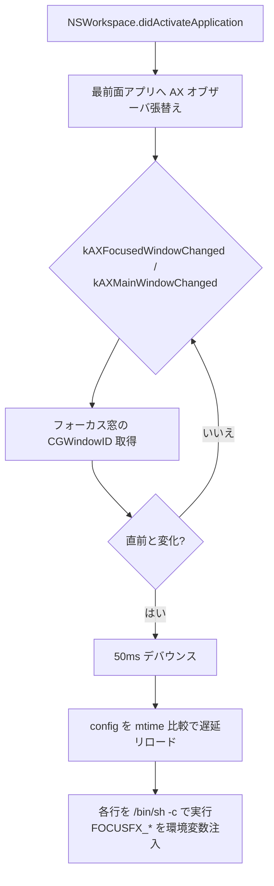

# focusfx

[English](README.en.md) | 日本語

アクティブ（フォーカス）ウィンドウが変わったら、設定された任意コマンドを実行する macOS 常駐デーモン。純粋な受動オブザーバで、外部のウィンドウマネージャに依存しない。効果音・枠強調などの「効果」は設定（コマンド文字列）側の責務で、本体は **検知とディスパッチしか持たない（ゼロハードコード）**。

## 特徴

- **ポーリングしない**。`NSWorkspace.didActivateApplication` ＋ AX イベント駆動
- 最前面アプリ 1 つにだけ AX オブザーバを張替え＝軽量
- 設定はホットリロード（保存すれば次の発火時に自動反映・再起動不要）
- 追加依存なし（純 `swiftc`）

## アーキテクチャ



## 要件

- macOS（近年のバージョン。`NSWorkspace` / AX を使用。最小バージョンは未検証）
- Xcode Command Line Tools（`swiftc`）
- アクセシビリティ権限（初回プロンプト。後述）

## インストール

```sh
git clone <this-repo> ~/dev/focusfx
cd ~/dev/focusfx
./install.sh
```

`install.sh` は次を自己発見パスで行う（ユーザー名非依存）:

1. `build.sh` でビルド
2. `~/.local/bin/focusfx` へ配置
3. `~/Library/LaunchAgents/com.local.focusfx.plist` を生成（`EnvironmentVariables/PATH` 込み）
4. `launchctl` で LaunchAgent 登録（`RunAtLoad` / `KeepAlive`）

初回はシステム設定 > プライバシーとセキュリティ > アクセシビリティ で
`~/.local/bin/focusfx` を許可してください。

## 設定

`${XDG_CONFIG_HOME:-$HOME/.config}/focusfx/config`

- **1 行＝1 コマンド**（`/bin/sh -c` で実行）。空行と `#` 行は無視
- 保存すれば次の発火時に自動反映（mtime ホットリロード・タイマー無し）
- 各コマンドへ context を環境変数で注入:

| 変数 | 内容 |
|---|---|
| `FOCUSFX_EVENT` | `"window_focused"` |
| `FOCUSFX_WINDOW_ID` | フォーカス窓の CGWindowID |
| `FOCUSFX_PID` | アプリの PID |
| `FOCUSFX_APP` | アプリ名 |
| `FOCUSFX_TITLE` | ウィンドウタイトル |

config 不在時はサンプルが自動生成される。暴走防止のため各コマンドは 10 秒で打ち切り。

## アンインストール

```sh
launchctl bootout gui/$(id -u)/com.local.focusfx
rm ~/Library/LaunchAgents/com.local.focusfx.plist ~/.local/bin/focusfx
```

## トラブルシュート

- **何も起きない**: アクセシビリティ未許可の可能性。`~/.local/state/focusfx.log` を確認し、`~/.local/bin/focusfx` を許可して再起動
- **Homebrew コマンドが動かない**: launchd 既定 PATH に Homebrew は無い。plist の `EnvironmentVariables/PATH` で解決済（`install.sh` 生成）。独自に PATH 依存コマンドを足す場合は留意
- ログ: `~/.local/state/focusfx.log`（本体）、`~/.local/state/focusfx.{out,err}.log`（launchd）

## 開発

- 本体は単一ファイル `main.swift`。`./build.sh` で `bin/focusfx` を生成（git 管理外）
- コミット規約: [docs/commit-convention.md](docs/commit-convention.md)（gitmoji + Conventional Commits）
- フック有効化: `git config core.hooksPath scripts/hooks`

## ライセンス

[MIT](LICENSE) © 2026 akira-toriyama
