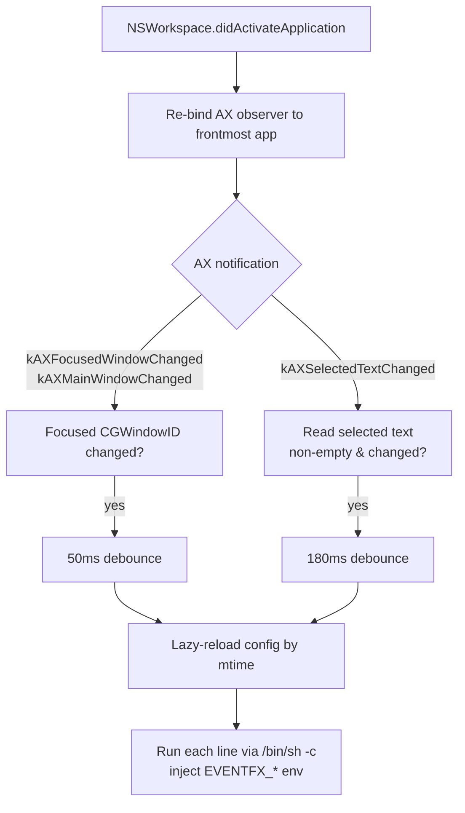

# eventfx


[](LICENSE)

**English** · [日本語](README.ja.md)

A macOS resident daemon that runs configured commands on AX-driven events —
**focused-window changes** and **text-selection changes**. Pure passive
observer, no external window manager required. Effects (sound, border
emphasis, launcher popup, …) are the responsibility of the configuration
(command strings); the binary only knows **detection and dispatch — zero
hardcoding**.

## Highlights

- **No polling.** Driven by `NSWorkspace.didActivateApplication` + AX events
- Two event types: `window_focused`, `text_selected` — dispatch via `$EVENTFX_EVENT`
- Re-binds an AX observer to only the single frontmost app → lightweight
- Hot-reloads config (save → applied on next event, no restart)
- No external dependencies (plain `swiftc`)

## Architecture



## Requirements

- macOS 13+ (Ventura). Matches the Homebrew formula's `depends_on macos: :ventura`
- Xcode Command Line Tools (`swiftc`). Uses `NSWorkspace` and the AX API
- Accessibility permission (prompted on first run)

## Install

Homebrew (recommended):

```sh
brew install akira-toriyama/tap/eventfx
brew services start eventfx
```

Or from source (no tap):

```sh
git clone https://github.com/akira-toriyama/eventfx.git ~/dev/eventfx
cd ~/dev/eventfx
./install.sh
```

`install.sh` self-discovers paths (username-independent):

1. Build via `build.sh`
2. Install to `~/.local/bin/eventfx`
3. Generate `~/Library/LaunchAgents/com.local.eventfx.plist`
   (with `EnvironmentVariables/PATH`)
4. Register the LaunchAgent via `launchctl`

On first run, allow `eventfx` under System Settings > Privacy & Security >
Accessibility.

## CLI

```
eventfx                run as daemon (default)
eventfx --debug        run + log to stderr and /tmp/eventfx.log
eventfx --validate     parse config, report count, exit
eventfx --doctor       self-check (AX / config / log / daemon), exit
eventfx --version      print version, exit
eventfx --help         print help, exit
```

## Configuration

`${XDG_CONFIG_HOME:-$HOME/.config}/eventfx/config`

- **One line = one command** (run via `/bin/sh -c`). Blank and `#` lines ignored
- Save → applied on next event (mtime hot-reload, no timer)
- Branch on `$EVENTFX_EVENT` to handle different event kinds
- Backslash line continuation (`\`) does **not** work — each physical line is
  dispatched as an independent command
- Context injected as environment variables:

| Variable | Event | Meaning |
|---|---|---|
| `EVENTFX_EVENT` | both | `"window_focused"` or `"text_selected"` |
| `EVENTFX_PID` | both | app PID |
| `EVENTFX_APP` | both | app name |
| `EVENTFX_WINDOW_ID` | `window_focused` | focused window CGWindowID |
| `EVENTFX_TITLE` | `window_focused` | window title |
| `EVENTFX_SELECTION` | `text_selected` | selected text |
| `EVENTFX_CURSOR_X` / `EVENTFX_CURSOR_Y` | `text_selected` | mouse coords at fire time (Cocoa system, all screens) |

Example — popup launcher near cursor on text selection (via [wand](https://github.com/akira-toriyama/wand) / `stroke`):

```sh
[ "$EVENTFX_EVENT" = text_selected ] && stroke --show-menu --items "$HOME/.config/eventfx/text_selected.toml" --at "$EVENTFX_CURSOR_X" "$EVENTFX_CURSOR_Y" --selection "$EVENTFX_SELECTION"
```

A sample is generated when the config is missing. Each command is killed after
10 seconds as a runaway guard.

## Uninstall

```sh
brew services stop eventfx
brew uninstall eventfx
# or, for the install.sh route:
launchctl bootout gui/$(id -u)/com.local.eventfx
rm ~/Library/LaunchAgents/com.local.eventfx.plist ~/.local/bin/eventfx
```

## Troubleshooting

- **Nothing happens**: Accessibility likely not granted. Check
  `~/.local/state/eventfx.log`, grant `eventfx`, restart
- **Homebrew commands fail**: launchd's default PATH lacks Homebrew; solved via
  the plist's `EnvironmentVariables/PATH` (generated by `install.sh` or by the
  formula's `service do` block)
- **Foreground debug**: `./run.sh -f` streams events to stderr — fastest way
  to see what's firing (default `./run.sh` deploys to ~/.local/bin)
- Logs: `~/.local/state/eventfx.log` (production), `/tmp/eventfx.log`
  (`--debug` only), `~/.local/state/eventfx.{out,err}.log` (launchd)

## Development

```sh
./build.sh                 # swift build -c release + codesign + cp to bin/
./run.sh                   # build + install.sh (~/.local/bin + LaunchAgent re-bootstrap) — default
./run.sh --foreground      # build + stop + foreground exec ./bin/eventfx --debug
./stop.sh                  # kill all eventfx instances (brew / launchd / orphans)
./setup-signing-cert.sh    # one-time: create persistent self-signed identity
./scripts/build-icon.sh    # regenerate AppIcon.icns from SF Symbol
swift test                 # run XCTest suite (EventfxCoreTests)
```

- SwiftPM project, hexagonal 3-layer split:
  `Sources/EventfxCore` (pure logic) /
  `Sources/EventfxAdapterMacOS` (AX + dispatch) /
  `Sources/EventfxApp` (CLI + @main)
- Tests in `Tests/EventfxCoreTests/` — exercise the config parser
- `./build.sh` codesigns with the persistent identity (`setup-signing-cert.sh`)
  if available, else ad-hoc. The persistent identity keeps the Accessibility
  grant alive across rebuilds (TCC keys on the codesign identifier)
- Suggested commit convention: gitmoji + Conventional Commits
  (`scripts/hooks/commit-msg` validates; enable with
  `git config core.hooksPath scripts/hooks`)
- Release notes are generated by `release.yml` via `cliff.toml`
- `update-tap.yml` auto-bumps `akira-toriyama/homebrew-tap` on release

## License

[MIT](LICENSE) © 2026 akira-toriyama
