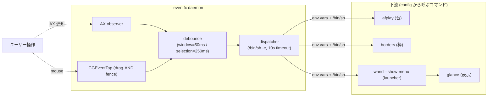
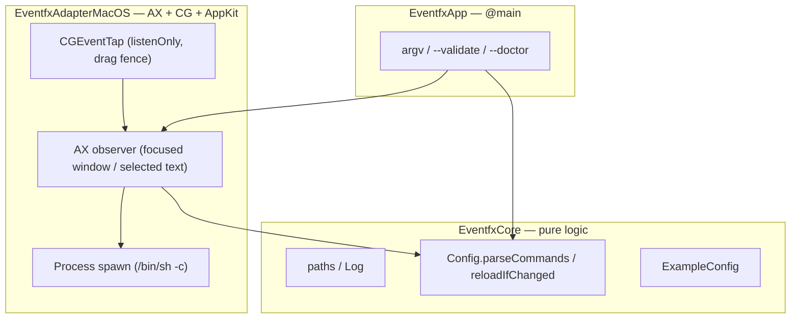

# 用語集 — eventfx のユビキタス言語

eventfx を構成する各パーツの **正規の呼び名** をまとめた規範ドキュメント。
**コード・ドキュメント・コミットメッセージ・PR タイトル・Claude Code への
プロンプト、すべてここに載っている名前のみを使う**。同義語は揺らぎを生む。
1 つに決めて、それで通す。

なお **正規名は英語のまま** 保持する。コード識別子・環境変数
（`EventfxCore`, `EVENTFX_EVENT`, `kAXSelectedTextChanged` など）と一対一に
対応させるため。日本語化するのは説明文だけ。

用語が足りなければ、その用語を導入する PR で同時にこのファイルへ追記する。
用語名を変える場合は、コード・ドキュメント・このファイルを **同一 PR で**
書き換える。

> 各エントリの形式: **正規名**, 1〜2 行の定義, 設定 / コードでの所在,
> そして `Don't call it:` 行 — このエントリが置き換える誤った呼び名のリスト。

---

## eventfx の立ち位置

eventfx は **検知とディスパッチしか担わない**。効果（音 / 枠 / ランチャー等）
は config が呼ぶコマンドに完全に外出し（ゼロハードコード）。

下の図は eventfx プロセス内の構造。

---

## レイヤー / モジュール

### EventfxCore
**純ロジック層**。Foundation のみ。AppKit / AX を含まない。XCTest で
単体検証可能。
- 場所: [`Sources/EventfxCore/`](../Sources/EventfxCore/)
- 含むもの: `paths`, `Log`, `Config.parseCommands`, `reloadIfChanged`,
  `ExampleConfig`
- **Don't call it:** domain layer, business logic, ドメイン層

### EventfxAdapterMacOS
**OS adapter**。AX オブザーバ、`NSEvent.mouseLocation` 取得、CGEventTap、
`/bin/sh` 経由のプロセス起動。Cocoa / AX 型はここだけ。
- 場所: [`Sources/EventfxAdapterMacOS/`](../Sources/EventfxAdapterMacOS/)
- **Don't call it:** native adapter, AX layer, AX 層

### EventfxApp
`@main`、CLI argv 解析、`NSApplication` 起動。
- 場所: [`Sources/EventfxApp/`](../Sources/EventfxApp/)
- **Don't call it:** main module, エントリーポイント

---

## イベント

### event
eventfx が発火する **AX 由来の検知単位**。種別は `$EVENTFX_EVENT` で
分岐する。
- **Don't call it:** notification, signal, シグナル, 通知

### `window_focused`
**フォーカス窓が変わった** ことを示す event。
- トリガ AX 通知: `kAXFocusedWindowChanged` / `kAXMainWindowChanged`
- env: 共通 env のみ（追加なし）
- debounce: **50ms**
- **Don't call it:** focus change, frontmost change, フォーカス変化

### `text_selected`
**マウスドラッグでテキストが選択された** ことを示す event。"AX 通知 AND
ドラッグ完了" の AND 条件で発火（キーボード選択 / IME / プログラム的選択は
除外）。
- トリガ AX 通知: `kAXSelectedTextChanged`
- 追加 env: `EVENTFX_SELECTION`, `EVENTFX_CURSOR_X`, `EVENTFX_CURSOR_Y`
- debounce: **250ms**（PopClip 体感に寄せた値）
- **Don't call it:** selection change, text highlighted, テキスト選択

### drag-AND fence
`text_selected` の発火条件。CGEventTap（listenOnly）で
`leftMouseDown → leftMouseDragged → leftMouseUp` のシーケンスを観測し、
drag 込みで完了した `mouseUp` の **直近性（0.5s 窓）** を AX 通知と AND
する。
- **Don't call it:** drag filter, mouse filter, マウスドラッグ判定

### IME suppression
`kAXSelectedTextRangeAttribute` の `length=0` を見て **marked text 状態の
偽発火を弾く** ロジック。日本語 IME 入力中の暴発防止。
- **Don't call it:** ime guard, ime filter, IME 抑止（説明文では可）

---

## env vars（dispatcher が渡す）

すべての event で共通:

### `EVENTFX_EVENT`
event 種別。`window_focused` か `text_selected`。config の `[ ... ]` ガード
で必ず最初に分岐する。
- **Don't call it:** kind, type, event type, イベント種別

### `EVENTFX_PID` / `EVENTFX_APP`
focused app の PID と bundle ID（取得不可なら `0` / 空文字 fallback）。
- **Don't call it:** app id, process id, アプリ ID

### `EVENTFX_WINDOW_ID` / `EVENTFX_TITLE`
focused window の CGWindowID と AX title。`text_selected` では選択が起きた
焦点窓のもの。取得不可なら `0` / 空文字 fallback。
- 取得方法: 非公開 API `_AXUIElementGetWindow` を `@_silgen_name` で取込
- **Don't call it:** window handle, win id, ウィンドウ ID

`text_selected` のみ:

### `EVENTFX_SELECTION`
選択テキスト文字列。**信頼できない値** としてシェル内では必ずクォート。
- **Don't call it:** selected_text, highlight, 選択テキスト（記述文中は OK）

### `EVENTFX_CURSOR_X` / `EVENTFX_CURSOR_Y`
**Cocoa 座標**（Y-up、全スクリーン）でのカーソル位置。`wand stroke
--show-menu --at` 契約と直接整合する。
- **Don't call it:** mouse_xy, cg coords, マウス座標（座標系が違うため
  紛らわしい）

---

## dispatcher

### `/bin/sh -c` dispatch
config 1 行を `/bin/sh -c` で実行する **唯一の発火経路**。env vars が
プロセスに渡される。
- **Don't call it:** runner, executor, ランナー

### 10s timeout
各コマンドは **10 秒で強制打ち切り**（`Process.terminate()` を
`DispatchQueue.global().asyncAfter` で見張る）。
- **Don't call it:** kill timeout, watchdog, タイムアウト（一般語は可）

---

## config

### config file
パス: `${XDG_CONFIG_HOME:-$HOME/.config}/eventfx/config`。
**1 行 = 1 コマンド**（`/bin/sh -c` 引数）。バックスラッシュ継続は **効か
ない**（改行を入れると意図しない 2 行目が無条件実行される）。空行と
`#` 行は無視。
- **Don't call it:** rules file, script, 設定スクリプト

### mtime hot reload
config の **保存で次イベント発火時に mtime を見て遅延再読込**。
タイマー禁止。
- 実装: `Config.reloadIfChanged`
- **Don't call it:** hot reload, file watch, ファイル監視（タイマー禁止
  方針を表すには弱い）

### `exampleConfig`
config 不在時に自動生成される **既定テンプレ**。リテラルで
[`Sources/EventfxCore/ExampleConfig.swift`](../Sources/EventfxCore/ExampleConfig.swift)
に保持。
- **Don't call it:** default config, template, デフォルト設定

---

## CLI

### `eventfx`
**デーモン本体**。argv なしで起動するとそのまま常駐に入る（LaunchAgent
からの典型呼び出し）。
- **Don't call it:** daemon binary, server, サービス

### `eventfx --validate`
**config をパースして件数を表示して exit**。設定ミス triage の一発目。
- **Don't call it:** check, dry-run, 検証

### `eventfx --doctor`
**AX / config / log / daemon の self-check**。bug report 添付用。
- **Don't call it:** healthcheck, sanity, セルフチェック

---

## 配布 / 環境

### LaunchAgent
本番稼働は **launchd 経由**。`./install.sh` が
`com.local.eventfx.plist` を生成して登録、`./run.sh` は再 bootstrap する。
- **Don't call it:** service, systemd, 常駐サービス

### `eventfx-dev` signing identity
**TCC（Accessibility）安定化** 用の **持続自己署名 cert**。Swift 既定
ad-hoc 署名は rebuild ごとに識別子が変わるため AX 許可が吹っ飛ぶ。
`./setup-signing-cert.sh` が作成、`./build.sh` 末尾で再署名。
`.signing-id` 不在 / cert 不在なら ad-hoc に透過 fallback。
- **Don't call it:** dev cert, ad-hoc cert, 開発署名

---

## デバッグ / ログ

### `EVENTFX_DEBUG`
**verbose ログの唯一のトリガ**（環境変数）。`--debug` フラグは廃止
（family 統一）。`run.sh -f` が自動 export、brew / raw 起動は静かなまま。
- **Don't call it:** --debug, --verbose, ログモード

### `~/.local/state/eventfx.log`
**production の常時ログ先**。
- **Don't call it:** main log, eventfx log（パスを明示する時のみ）

### `/tmp/eventfx.log`
`EVENTFX_DEBUG=1` 時の **verbose ミラー**。家風 `/tmp/<app>.log`。
- **Don't call it:** debug log, trace file, トレースログ

---

## エントリ追加時のルール

- 1 つの概念につき正規名は 1 つ。複数の呼び方が流通しているなら、
  このファイルで勝者を選び、敗者は `Don't call it:` 行に並べる。
- 正規名は **英語のまま** 書く。env 変数（`EVENTFX_*`）/ AX 通知名
  （`kAXSelectedTextChanged`）はその表記を維持する。
- 定義は **1〜2 文** に収める。動作の詳細は設定セクションやソース
  ファイルへリンクし、ここで説明し直さない。
- 下流の連携先（wand / glance / borders / afplay 等）の用語と衝突しないか
  確認する。衝突する場合は **eventfx 側で別名を取る** か `Don't call it:`
  に並べて棲み分けを明記する。
